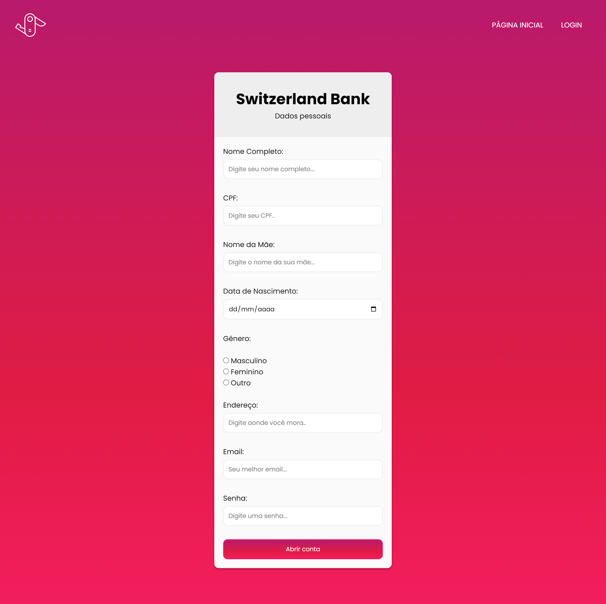
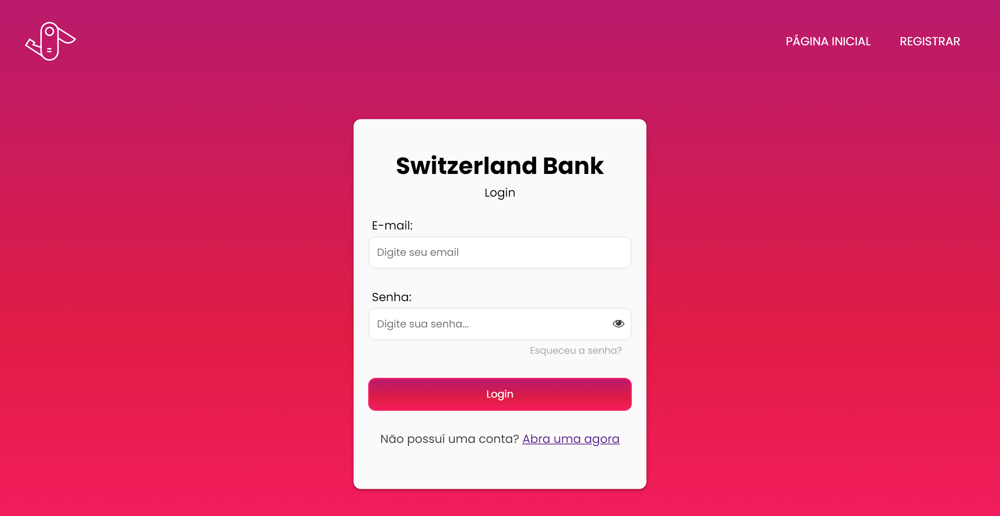
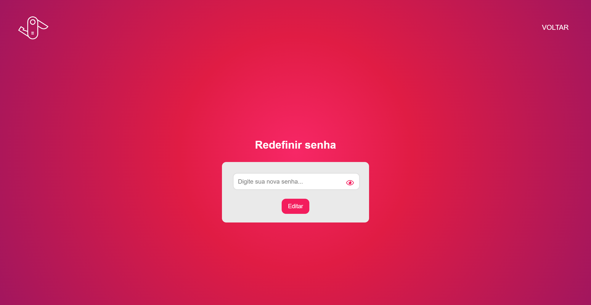
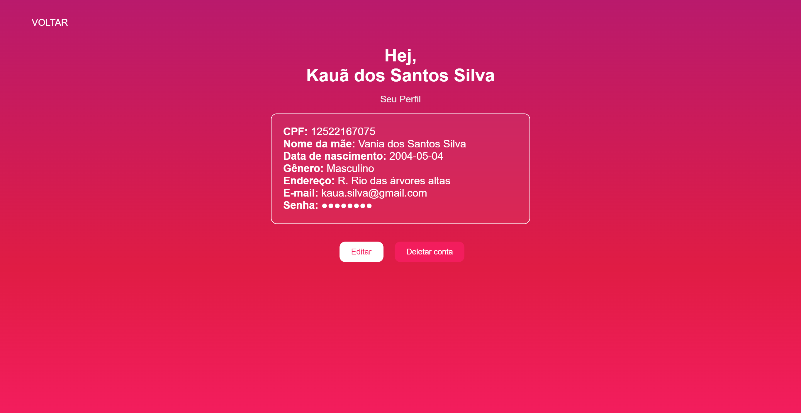
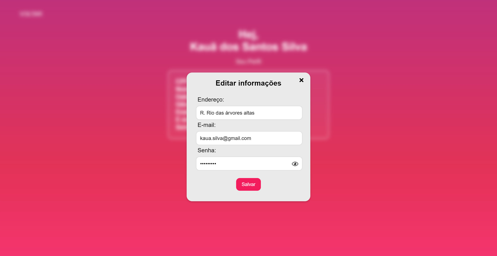
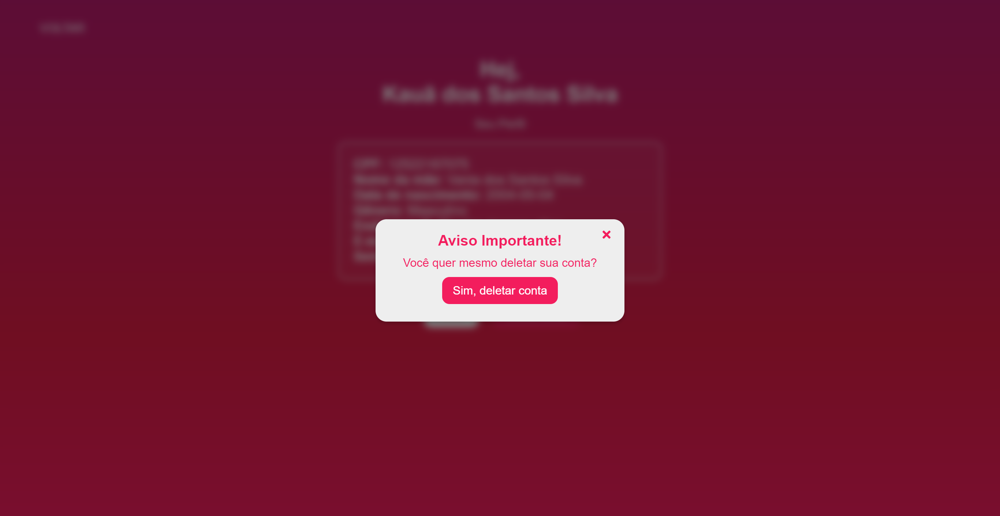
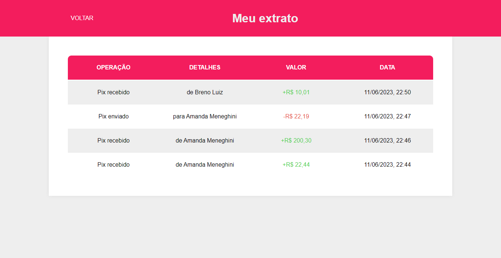
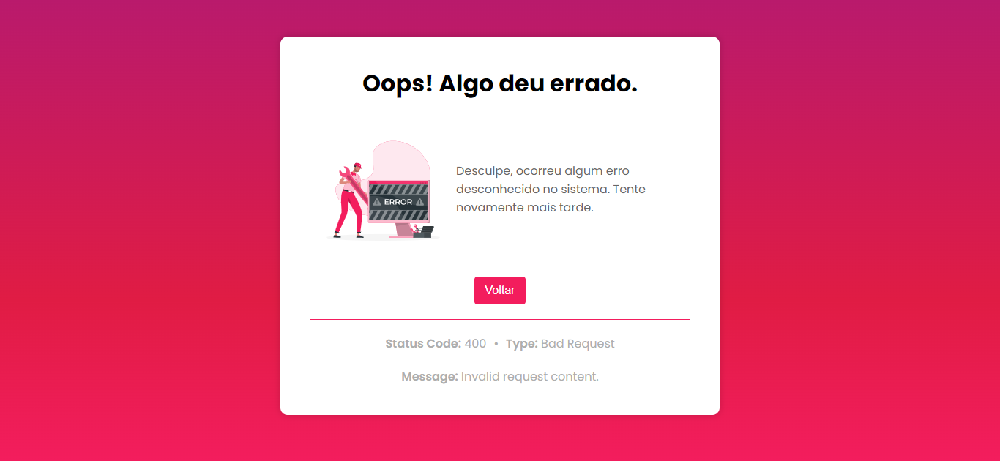

# Switzerland Bank 


## Descrição
O Switzerland Bank é uma simulação de um banco digital desenvolvido com Spring Boot e Java. O projeto oferece uma solução para efetuar pagamentos através do PIX, gerenciar perfis de clientes, visualizar o extrato e solicitar um cartão de crédito e débito. Com o Switzerland Bank, os usuários podem desfrutar de uma experiência bancária moderna e eficiente.

## Demonstração e Utilização
1. Acesse a página principal do Switzerland Bank e decida se deseja criar uma conta ou fazer o login.
    

2. Para criar uma conta, acesse a página de registro e preencha o formulário com suas informações pessoais.
    

3. Após o registro, faça o login na página de login utilizando as credenciais cadastradas.
    

4. Caso você tenha esquecido sua senha, você pode redefini-la, com o link para o modal de validação.
    
    

5. Na página de dashboard, você terá acesso a todas as funcionalidades do Switzerland Bank, como efetuar PIX, gerencimanento de conta, extrato, solicitar cartão e fazer o logout, saindo da conta.
    

6. Utilize a página de Visualizar Perfil para verificar suas informações cadastradas, editar alguma informação, ou deletar a sua conta do Switzerland Bank.
    
    
    

7. Realize transações PIX para outros usuários do Switzerland Bank através da página PIX.
    

8. Verifique o histórico de transações na página de extrato, onde todos os registros de transações serão exibidos com detalhes como tipo, descrição, valor e data/hora.
    

9.  Caso ainda não possua um cartão de crédito ou débito, utilize a página de cartão (Card) para solicitar um. se já posuir um, você poderá visualizar as informações do cartão.
    
    

10. Caso você tentar entrar em algum lugar desconhecido, aparecerá uma página de erro 404.
    
11. Ou então, se ocorrer algum erro diferente, você será redirecionado a página de erros.
    

## Instalação
Siga as instruções abaixo para instalar e configurar o projeto Switzerland Bank em seu ambiente local:

1. Clone o repositório para o seu computador:
   ```bash
   git clone https://github.com/kauassilva/Switzerland_Bank.git
   ```
2. Navegue até o diretório do projeto:
   ```bash
   cd Switzerland_Bank
   ```
3. Configure um banco de dados MySQL, criando um schema com o nome "switzerlandbank_db".
4. Configure as informações de conexão com o banco de dados no arquivo `application.properties`:
   
   ```
    spring.datasource.url=jdbc:mysql://localhost:3306/switzerlandbank_db?ServerTimezone=UTC
    spring.datasource.username=seu_usuario
    spring.datasource.password=sua_senha
   ```
5. Inicie aplicação Spring Boot, através da classe `SwitzerlandBankApplication.java`.
6. Acesse a aplicação no seu navegador através do seguinte endereço: `http://localhost:8080`


## Créditos
* Ilustrações das páginas de erro pela [Storyset](https://storyset.com/web)
* Fonte `Poppins` pelo [Google Fonts](https://fonts.google.com/)


## Licença
Este projeto está licenciado sob a [MIT Licence](https://github.com/kauassilva/Switzerland_Bank/blob/main/LICENSE)


## Equipe
* [Kauã dos Santos Silva](https://github.com/kauassilva) - 12522167075
* [Amanda Duarte Meneghini do Carmo](https://github.com/AmandaMeneghini) - 12522192773
* [Breno Luiz Fialho dos Santos](https://github.com/BrenoLuiz19) - 12522169352
* [Jullia Kathelyn dos Santos Correia](https://github.com/julliakathelyn) - 12522226203
